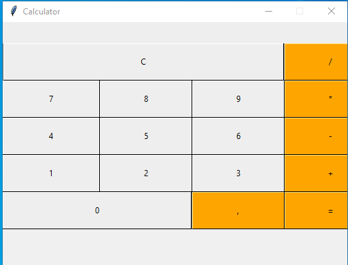
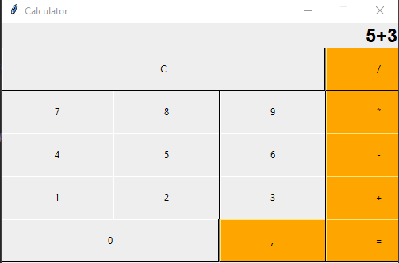
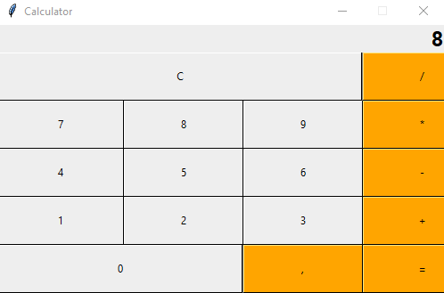

# Calculator-Tk
Sample Calculator GUI with Tkinter

# Description
### This is a desktop application to create a simple GUI calculator using Tkinter.
 
# How to run
### We have an input field in which the user input will be shown, and the final result of the calculation will be displayed.

----------------------------
# Output
### Using the input field, buttons and for the calculation purpose we will use logic in our code defined in functions, like if you want to add two numbers then behind this there must be a logic for addition purpose, similarly for substraction, multiplication, etc, we have created functions whose task is to perform these operations.

-----
## Documentation: https://docs.python.org/3/library/tk.html
